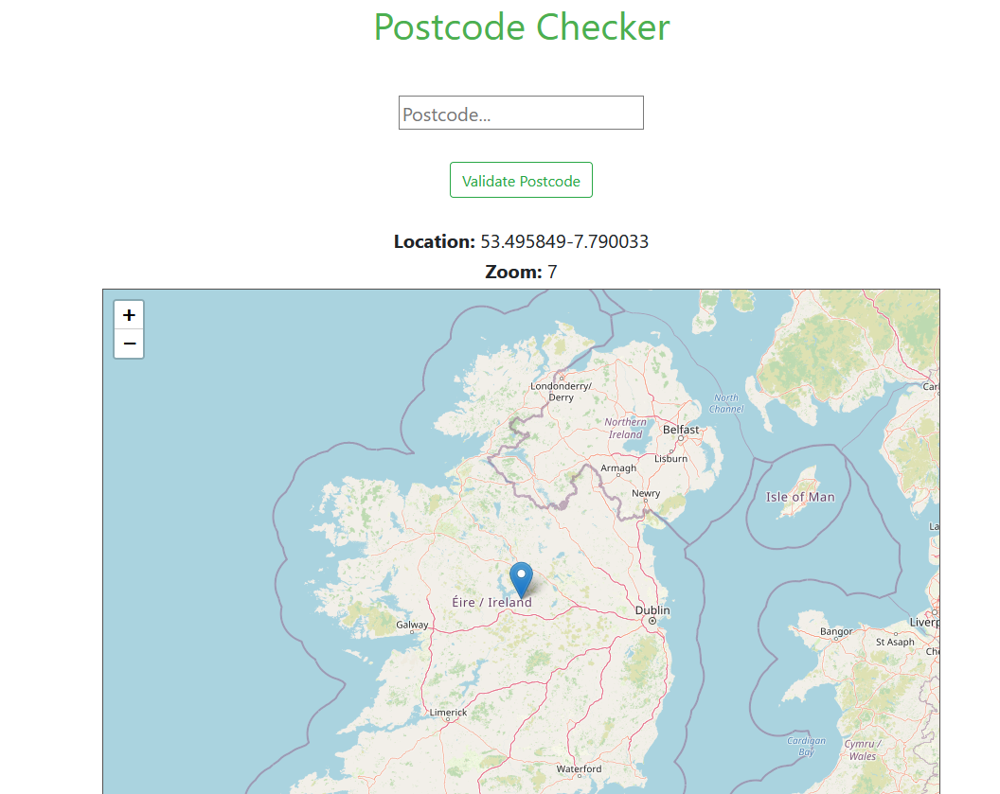
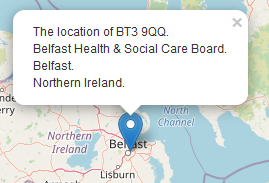

# react_postcode_checker


## Table of contents
* [General info](#general-info)
* [Technologies](#technologies)
* [Screenshot](#screenshot)
* [Setup](#setup)

## General info
The user enters their postcode, which is validated using [@postcode.io API](http://postcodes.io/) and the location is displayed on a map.  
For Leaflet inspiration [@sabrinasuarezarrieta](https://dev.to/sabrinasuarezarrieta/how-to-implement-react-leaflet-js-maps-in-your-react-project-igo)  
Resolve missing default Leaflet Marker
[@ghybs](https://github.com/ghybs/leaflet-defaulticon-compatibility)
	
## Technologies
Project created with:
* React
* Javascript
* HTML  
### Libraries  
* [Leaflet](https://leafletjs.com/)
* [Leaflet React](https://react-leaflet.js.org/)

### Icons 
* Postcode icon from [icons8.com](https://icons8.com/icons/set/postcode)
* Resized using [Online png tools](https://onlinepngtools.com/resize-png)

## Screenshot
<div align="center">
        Main Page
        <br>
        
        <br> Sample Popup
        <br>
                
</div>

## Setup

After you clone this Repository to your desktop, go to its root directory and run [@npm](https://www.npmjs.com/get-npm) to install its dependencies.  
Once the dependencies are installed, you can run npm start to start the application.  
You will then be able to access it at localhost:3000

Commands
```
$ cd ../lorem
$ npm install
$ npm start
